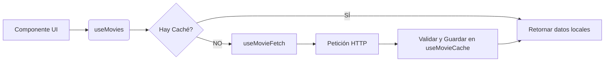

# Documentación Técnica: Refactorización de useMovies

Este documento detalla la estructura modular del hook `useMovies` tras su división en submódulos para mejorar la mantenibilidad y el rendimiento.

## 🤔 ¿Por qué se dividió en 3 hooks?

La lógica de obtención de películas creció hasta manejar caché, red, paginación y validación en un solo punto. La refactorización aplica el principio de **Separación de Preocupaciones**:

1.  **`useMovieCache`**: Gestiona la persistencia en `sessionStorage` con TTL.
2.  **`useMovieFetch`**: Aísla la capa de red y la gestión de cancelaciones (`AbortController`).
3.  **`useMovies`**: Actúa como fachada y orquestador para la interfaz de usuario.

---

## 🏎️ Flujo de Trabajo (Relación entre Hooks)



---

## 🛠️ Guía de Uso para Desarrolladores

El hook principal expone una interfaz simplificada. Es crucial manejar correctamente los estados de carga y error para una buena UX.

### Ejemplo de Implementación:
```tsx
const Discovery = () => {
  const { movies, loading, error, loadMore, hasMore } = useMovies({ genreId: 12 });

  if (error) return <ErrorMessage message={error} />;

  return (
    <main>
      <MovieList data={movies} />
      {loading && <Spinner />}
      {hasMore && <button onClick={loadMore}>Ver más</button>}
    </main>
  );
};
```

---

## 📊 API Reference

| Elemento | Tipo | Descripción |
| :--- | :--- | :--- |
| `movies` | `TMDBMovie[]` | Array de películas resultante de la combinación de páginas. |
| `loading` | `boolean` | Estado de carga activo (red o procesamiento). |
| `error` | `string \| null` | Error capturado durante el proceso. |
| `loadMore` | `() => void` | Función para solicitar la siguiente página de resultados. |

---

## 🚫 Errores Comunes (Anti-patrones)

1.  **No validar `hasMore` antes de `loadMore`**: Intentar cargar más páginas cuando ya se ha llegado al límite de la API.
2.  **Falta de `loading state` en botones**: No deshabilitar el botón de "Cargar más" mientras hay una petición en vuelo, causando duplicidad de datos.
3.  **Dependencias Circulares**: Pasar funciones del hook a sus sub-hooks de forma que creen loops de re-renderizado.

---
Para más detalles sobre la arquitectura, consulta el archivo de Skill en [.agents/Explain_useMovies.skill.md](.agents/Explain_useMovies.skill.md).
